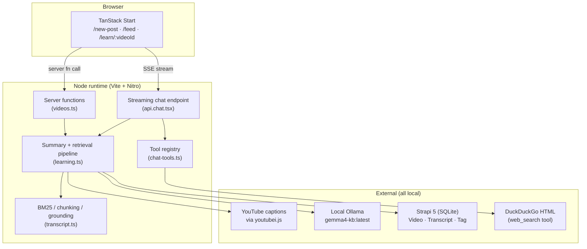
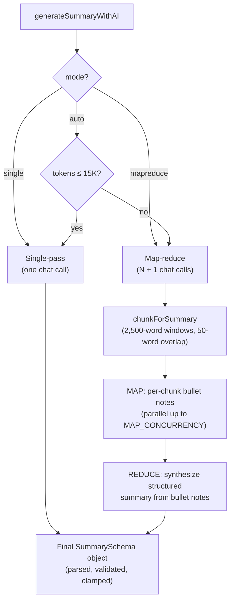
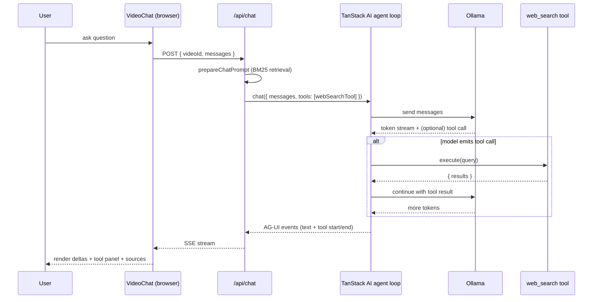
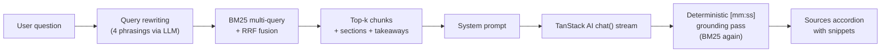

**TL;DR**

- We built **YT Knowledge Base** — a 100% local-first app that turns any YouTube video into a structured AI summary you can chat with, with deterministic timecode citations, BM25 retrieval, and a `/web` slash-command escape hatch — no cloud APIs, no accounts.
- The stack is **TanStack Start + React 19 + Tailwind v4** on the front, **Strapi 5** on the back, and **Ollama** running a local Gemma model for every LLM call.
- All data fetching, mutations, and the streaming chat endpoint go through the **TanStack ecosystem** — `react-form` for the share form, `createServerFn` for RPC-style data fetching, and **TanStack AI** with the `@tanstack/ai-ollama` adapter for both structured summary generation and tool-calling chat.
- Long videos auto-switch to a **map-reduce** summary pipeline. Short videos run **single-pass**. Either way, the model never invents timestamps — they're recovered from the transcript via **BM25 grounding** after the fact.
- The chat side uses **contextual retrieval + query rewriting + reciprocal rank fusion** for top-k chunks, then streams **AG-UI-format SSE** back to the browser, including expandable tool-call panels when the model invokes `web_search`.


## What we built

YT Knowledge Base is a single-user, local-first knowledge base for YouTube videos. The pitch is short: paste a URL, and a few minutes later you have a structured, AI-generated summary — title, description, key takeaways, a chronological walkthrough with clickable timecodes, and concrete action steps. Below the summary, a streaming chat panel lets you ask follow-up questions about the video, with citations that seek the player when you click them, and a built-in `web_search` tool the model can call when the transcript doesn't cover your question.

Three things make it different from "just paste this into ChatGPT":

1. **It runs entirely on your machine.** Inference happens in [Ollama](https://ollama.com). Storage is [Strapi](https://strapi.io) on SQLite. Captions are pulled in-process via [`youtubei.js`](https://github.com/LuanRT/YouTube.js). 
2. **Citations.** The model is explicitly instructed *not* to emit timecodes. After generation, every section heading and every `[mm:ss]` chip in chat answers is matched back to the transcript via BM25 — the chip points to the *real* caption-segment start, not whatever the model halucinated.
3. **Long videos work.** Above ~15K tokens, the summary pipeline switches from a single-pass call to a map-reduce flow that summarizes ~17-minute windows in parallel, then synthesizes the final structured output from those bullet notes.


## Why I built this

Two things motivated this project, and they ended up reinforcing each other.

**First, I wanted a serious excuse to explore local models.** The hosted-LLM ecosystem is great, but it makes you forget what's actually running underneath — every API call hides the model, the prompt template, the tokenizer, the context budget, the inference loop. Building something non-trivial against a local Ollama instance forces all of that back into view: you feel the difference between a 4B and an 8B model, you watch your KV cache eat your VRAM, you learn that `temperature: 0.3` versus `1.0` is the difference between "grounded summary" and "creative fiction". I wanted a project where those choices were *mine*, not abstracted away behind someone else's API.

A few specific things I wanted to learn by doing:

- How far can a small local model go on a real, structured task — not just "tell me a joke" but JSON-mode constrained outputs, tool calling, and multi-step retrieval pipelines?
- What does the agentic loop actually look like when you control every layer of it (TanStack AI's `chat()` + adapter + tools)?
- Where is the line between "BM25 is enough" and "you need embeddings"? You don't really know until you ship something against both edges.

**Second, I wanted a better way to consume YouTube.** YouTube has become one of the most important publishing surfaces for technical content — talks, tutorials, conference recordings, founder interviews — but the actual *consumption* experience is terrible. There's no way to skim. Every video is a fixed-duration linear commitment. The thumbnail and title tell you almost nothing about whether the next 45 minutes are worth your time. By the time you find out a video is mostly filler or doesn't cover the thing you actually wanted, you've already spent 20 minutes scrubbing.

I wanted an app that lets you **audit a video before committing to it**:

- Read a 60-second structured summary — title, takeaways, walkthrough, action steps — and decide whether the video is worth your time at all.
- If it is, jump straight to the section you actually care about via clickable `[mm:ss]` chips, instead of scrubbing blindly.
- If you have a specific question ("does this talk cover X?"), ask it in chat and get an answer with grounded citations *before* you press play.
- Build a personal library over time — the videos you've vetted, summarized, and chatted with — that you can search and revisit later, without trusting any of it to a third-party service.

The local-first piece matters here too: the videos *I* find worth keeping are mine, the notes I add are mine, and none of it lives on someone else's server waiting to be re-trained on or rate-limited. It's a personal knowledge base, not a SaaS account.

So that's the why: a chance to build something real on top of local models, in service of consuming YouTube less wastefully. The two motivations turned out to fit together neatly — efficient consumption needs structured summaries and grounded chat, and local models are exactly capable enough (with the right pipeline around them) to deliver both.

## Tech used

| Layer | Tech |
|---|---|
| Client framework | [TanStack Start](https://tanstack.com/start) (Vite + Nitro), React 19 |
| Routing | [TanStack Router](https://tanstack.com/router) (file-based) |
| Forms | [TanStack React Form](https://tanstack.com/form) + Zod validators |
| Server functions | `createServerFn` from `@tanstack/react-start` |
| AI / LLM | [TanStack AI](https://tanstack.com/ai/latest) + `@tanstack/ai-ollama` adapter |
| Local model | [Ollama](https://ollama.com) running `gemma4-kb:latest` (custom Modelfile, Q4) |
| Backend / CMS | [Strapi 5](https://strapi.io), SQLite for dev, Postgres-ready |
| Transcripts | [youtubei.js](https://github.com/LuanRT/YouTube.js) directly against caption tracks |
| Styling | [Tailwind v4](https://tailwindcss.com), [Radix UI](https://www.radix-ui.com), [shadcn](https://ui.shadcn.com) primitives |
| Markdown rendering | `react-markdown` + `remark-gfm` |
| Validation | [Zod](https://zod.dev) (forms, server functions, structured AI outputs) |

The whole monorepo is two yarn workspaces — `client/` and `server/` — wired together by a root `package.json` and a `start.sh` that brings up Ollama, Strapi, and the TanStack client in one command.

## Architecture at a glance



Three Strapi content types hold everything:

- **Transcript** — immutable per `youtubeVideoId`. Caption segments + duration + title. Created once, reused across every regeneration so YouTube is never re-hit.
- **Video** — your instance of a video. Holds the AI summary, sections, takeaways, action steps, BM25 retrieval index, and your own notes.
- **Tag** — user-created labels, lowercase-normalized via Strapi middleware.

## How we built it

The remaining sections walk through the four pieces of the app where the interesting stuff lives:

1. The **share-a-video form** (TanStack React Form + a server function).
2. **Summary generation** (TanStack AI + Ollama, single-pass and map-reduce).
3. The **streaming chat endpoint** (TanStack AI agent loop with a `web_search` tool over SSE).
4. **BM25 grounding** that ties the model's natural-language output to real caption timestamps.

### 1. The share form: TanStack React Form → server function

The `/new-post` form is a small `useForm` setup with Zod validators. On submit it calls a `createServerFn` RPC handler that creates the Strapi `Video` row immediately and kicks off summary generation in a fire-and-forget background task. By the time the router navigates the user to `/learn/$videoId`, the row exists and the summary is already running on the server.

```tsx
// client/src/components/NewPostForm.tsx
const form = useForm({
  defaultValues: {
    url: '',
    caption: '',
    tags: '',
    mode: 'auto' as GenerationMode,
  } satisfies ShareVideoFormValues,
  validators: { onChange: ShareVideoFormSchema as never },
  onSubmit: async ({ value }) => {
    const parsed = ShareVideoFormSchema.safeParse(value);
    if (!parsed.success) {
      setServerError('Fix the highlighted fields and try again');
      return;
    }
    const result = await shareVideo({
      data: {
        url: parsed.data.url,
        caption: parsed.data.caption || undefined,
        tags: parsed.data.tags || undefined,
        mode: parsed.data.mode,
      },
    });
    if (result.status === 'error') return setServerError(result.error);

    await router.invalidate();
    router.navigate({
      to: '/learn/$videoId',
      params: { videoId: result.video.youtubeVideoId },
    });
  },
});
```

The server function on the other end is a `createServerFn` with a Zod input validator and a typed handler — there's no separate REST route, no manual fetch, no axios. Type information flows end-to-end:

```ts
// client/src/data/server-functions/videos.ts
export const shareVideo = createServerFn({ method: 'POST' })
  .inputValidator((data: z.input<typeof ShareVideoInputSchema>) =>
    ShareVideoInputSchema.parse(data),
  )
  .handler(async ({ data }): Promise<ShareVideoResult> => {
    const videoId = extractYouTubeVideoId(data.url);
    if (!videoId) return { status: 'error', error: "Doesn't look like a YouTube URL" };

    const alreadyExists = await fetchVideoByVideoIdService(videoId);
    if (alreadyExists) return { status: 'exists', video: alreadyExists };

    const meta = await fetchYouTubeMeta(videoId);
    const result = await createVideoService({
      videoId,
      url: data.url,
      caption: data.caption,
      tagNames: parseTagInput(data.tags ?? ''),
      videoTitle: meta.title,
      videoAuthor: meta.author,
      videoThumbnailUrl:
        meta.thumbnailUrl ?? `https://i.ytimg.com/vi/${videoId}/hqdefault.jpg`,
    });
    if (!result.success) return { status: 'error', error: result.error };

    kickoffSummaryGeneration(videoId, data.mode);  // fire-and-forget
    return { status: 'created', video: result.video };
  });
```

`kickoffSummaryGeneration` adds the videoId to a shared in-memory `Set` to dedupe parallel triggers, then kicks off the real work in an async IIFE so the user sees the response in a few hundred milliseconds rather than waiting minutes for inference.

The same `createServerFn` pattern powers the rest of the data layer — `getFeed`, `getVideoByVideoId`, `getGenerationProgress`, `triggerSummaryGeneration`, `regenerateSummary`, `updateSectionTimecode`, `searchTags`. Every TanStack Router route loader calls these directly:

```ts
// client/src/routes/feed.tsx
export const Route = createFileRoute('/feed')({
  validateSearch: FeedSearchSchema,
  loaderDeps: ({ search }) => ({ q: search.q, tag: search.tag, page: search.page }),
  loader: async ({ deps }) => {
    const result = await getFeed({
      data: { q: deps.q, tag: deps.tag, page: deps.page ?? 1, pageSize: 20 },
    });
    return { result };
  },
  component: FeedPage,
});
```

The route validates URL search params with Zod, declares them as loader deps, and gets full type-safe access to `result` in the component via `Route.useLoaderData()`.


### 2. Summary generation: TanStack AI + Ollama with structured output

The summary pipeline is where TanStack AI does the heavy lifting. We instantiate the Ollama adapter once per model and reuse it across calls:

```ts
// client/src/lib/services/learning.ts
import { chat } from '@tanstack/ai';
import { createOllamaChat } from '@tanstack/ai-ollama';

const OLLAMA_HOST = (process.env.OLLAMA_BASE_URL ?? 'http://localhost:11434/v1')
  .replace(/\/v1\/?$/, '');
const SUMMARY_MODEL = process.env.OLLAMA_MODEL ?? 'gemma4-kb:latest';

const ollamaAdapter = createOllamaChat(SUMMARY_MODEL, OLLAMA_HOST);
```

#### Why two pipelines?

A YouTube transcript is wildly variable in length — a 5-minute explainer might be 1,000 tokens; a 90-minute interview can hit 22,000+. We could try to handle both with one strategy, but each end of the spectrum punishes the other:

- **Stuff everything into one prompt** and short videos work great, but long videos run out of context window — and even when they fit, the model's attention spreads thin and the back half of the transcript turns into vague hand-waving.
- **Always chunk-and-synthesize** and long videos work great, but short videos pay a 3-4× latency tax for parallel calls that have nothing meaningful to do.

So we run two pipelines and route between them based on token count. The cutover lives at `SINGLE_PASS_TOKEN_BUDGET = 15_000` — below it, single-pass; above it, map-reduce. (`auto` mode picks for you; `single` and `mapreduce` are user overrides for the rare cases the heuristic gets it wrong.)



#### The single-pass pipeline (short videos)

For transcripts under ~15K tokens, we hand the whole cleaned transcript to **one** `chat({ outputSchema })` call. The flow is:

1. **Build the user prompt** — title, channel, video duration as a hint ("target ~1 section per 10 minutes"), then the full cleaned transcript appended at the bottom.
2. **Send one chat call** with the `SummarySchema` as `outputSchema`. TanStack AI translates the Zod schema into Ollama's native JSON-mode `format` parameter, so the model is *constrained* at decode time to produce JSON that matches the shape — no markdown fences, no preamble, no "Sure, here's your summary!".
3. **Parse + validate + clamp.** TanStack AI parses the response and validates it against the schema. We then clamp any over-length fields (Strapi rejects the whole document on a single field-length violation, so a runaway 320-character takeaway would otherwise blow up the entire save).

```ts
const SummarySchema = z.object({
  title: z.string().describe('Short punchy title. MAX 200 characters.'),
  description: z.string(),
  overview: z.string(),
  keyTakeaways: z.array(z.object({ text: z.string() })),
  sections: z.array(z.object({
    heading: z.string(),
    body: z.string(),
  })).min(2).max(15),
  actionSteps: z.array(z.object({ title: z.string(), body: z.string() })),
});

const object = (await chat({
  adapter: ollamaAdapter,
  messages: [
    { role: 'system', content: SUMMARY_SYSTEM },
    { role: 'user', content: userPrompt },
  ] as never,
  outputSchema: SummarySchema,
  temperature: 0.3,
})) as GeneratedSummary;
```

A few things worth calling out about this single call:

- **`temperature: 0.3`** suppresses creative drift. Ollama's default of 1.0 is great for chat, but for structured summarization we want grounded prose, not invention — especially in the action steps, where confabulated specifics ("install the X plugin") look authoritative when they're actually guesses.
- **`.describe()` doubles as a soft constraint.** Each schema field's `.describe()` text gets surfaced to the model alongside the JSON shape, which is why we put hard-limit hints (`MAX 280 characters`) and ordering rules ("sections IN CHRONOLOGICAL ORDER from start to end") right in the schema.
- **The system prompt forbids timecodes.** It carries an explicit *"do NOT emit timecodes. Leave `timeSec` unset"* rule, because timecodes get recovered deterministically from the transcript afterwards (see section 4) — anything the model writes there would just be discarded.
- **One call, one network round-trip, one model load.** For a 10-minute video, total wall time is usually 30-60 seconds on an M-series Mac.

#### The map-reduce pipeline (long videos)

Map-reduce is borrowed from classic distributed-data-processing — split the input across N workers, summarize each piece independently, then combine the partial results. LangChain popularized the pattern for LLM summarization; we run our own minimal implementation in pure JS rather than pulling in a framework.

For our case, the trade-off is exactly the one map-reduce was invented for: **a single LLM call can't pay attention to 90 minutes of transcript at once, but it can pay great attention to a 17-minute window**. So we split the transcript into windows, summarize each one in parallel, and then do a final synthesis pass that turns the bullet notes into the same structured `SummarySchema` as the single-pass path.

**Step 1 — Chunk.** `chunkForSummary` splits the cleaned transcript into ~2,500-word windows (~17 minutes of speech) with a 50-word overlap so we don't cut a thought clean in half across the seam. Each window carries the real `timeSec` of its first word, sourced from the caption-segment timestamps we preserved during cleaning.

**Step 2 — Map (in parallel).** Each window goes to its own `chat()` call with a tight system prompt: *"You read one window of a YouTube transcript and produce concise bullet notes on what was said."* The map model gets a different, simpler instruction than the reduce model — its only job is faithful note-taking, not synthesis. We use `stream: false` here because we don't surface map output to the UI, only the aggregate progress.

The parallelism uses a classic **worker-pool pattern** rather than `Promise.all(chunks.map(...))`. The difference matters: `Promise.all(map)` would fire all N requests at once, which Ollama would just queue (it serves requests against `OLLAMA_NUM_PARALLEL` slots). The worker pool gives us a constant in-flight count that matches the configured concurrency, which is honest about what's actually happening on the GPU and lets us report `"map 4/9 done · 2 running"` truthfully:

```ts
let cursor = 0;
const partialNotes: string[] = new Array(chunks.length);

const workers = Array.from({ length: MAP_CONCURRENCY }, async () => {
  while (true) {
    const i = cursor++;             // atomic in JS's single-threaded event loop
    if (i >= chunks.length) return;
    await processChunk(i);          // writes into partialNotes[i] by index
  }
});
await Promise.all(workers);
```

`MAP_CONCURRENCY` defaults to 1 (safe on any laptop). Bumping it to 2-4 helps on machines with RAM headroom — but it must match `OLLAMA_NUM_PARALLEL` on the Ollama server, or extra requests just queue. Each extra slot costs ~3GB of KV cache on an 8B model at `num_ctx=32768`, so on a 24GB Mac with Chrome/editor open, 2 can push you into swap and end up *slower* than 1.

Writing results into `partialNotes[i]` *by index* — rather than pushing in completion order — guarantees the reduce step sees windows chronologically, which matters because the reduce prompt explicitly tells the model "these notes are in chronological order; produce sections that span from the start of the video to the end".

**Step 3 — Reduce.** Once all windows have produced bullet notes, we concatenate them and run **one** more `chat({ outputSchema: SummarySchema })` call — the same call as the single-pass path, with the same schema, the same `temperature: 0.3`, and the same anti-confabulation system prompt. The only difference is the input: instead of a 22K-token raw transcript, the reduce step sees ~5K tokens of pre-digested bullet notes. The model has no trouble paying attention to all of it, so the resulting sections actually cover the back half of the video instead of trailing off after the opening:

```ts
const reduceUser = [
  `Video duration: ${formatTimecode(transcript.durationSec)}.`,
  `You are summarizing a ${formatTimecode(transcript.durationSec)}-long video from per-window bullet notes (each window covers a distinct portion of the video).`,
  `CRITICAL: Your sections MUST cover the ENTIRE video — including the FINAL windows. ${partialNotes.length} windows of notes → produce sections that collectively reference all of them.`,
  '',
  'Window notes:',
  partialNotes.join('\n\n'),
].join('\n');

const object = await chat({
  adapter: ollamaAdapter,
  messages: [
    { role: 'system', content: SUMMARY_SYSTEM },
    { role: 'user', content: reduceUser },
  ] as never,
  outputSchema: SummarySchema,
  temperature: 0.3,
});
```

Because the reduce step lands on the exact same schema as single-pass, **everything downstream — clamping, BM25 grounding, Strapi save, learn-page rendering — is identical between the two pipelines**. The branching is fully contained inside `generateSummaryWithAI`; the rest of the system has no idea which path produced the summary.

#### What we tuned, and why

A few non-obvious knobs that shaped this design:

- **`SINGLE_PASS_TOKEN_BUDGET = 15_000`** (originally 25K). At 25K, a 100-minute video would *technically* fit in single-pass — but with under 10K tokens of headroom for the system prompt + structured-output bookkeeping against `num_ctx=32768`, the model produced shallow, generic sections. Lowering the cutover to 15K means anything past ~60 minutes goes through map-reduce, which gives more coherent per-section attention.
- **2,500-word map windows.** Big enough that each window is a genuinely meaningful chunk of the video (~17 minutes of speech, usually a complete topic arc); small enough that the model can summarize one carefully in 10-15 seconds. The 50-word overlap is a hedge against cutting a sentence at the seam.
- **Map step uses `stream: false`, reduce step uses structured output.** Map output is plain prose for internal consumption, so streaming buys nothing; reduce output is the user-visible structured summary, so we want JSON-mode constraint decoding.
- **Retries (`withRetry`) wrap every model call with 2 attempts.** Local models occasionally produce malformed JSON or empty completions under memory pressure; retrying once costs less than failing the whole 10-minute generation run.

Throughout the run, a server-side progress map (`videoId → { step, detail, elapsedMs }`) is updated so the `/learn/$videoId` page can poll a `getGenerationProgress` server function and show a live label like `"map 4/9 done · 2 running"`.


### 3. Chat: TanStack AI agent loop + SSE streaming + a web_search tool

The chat endpoint is a TanStack Router file route that returns a Server-Sent Events stream in **AG-UI format**. The whole thing fits in a single handler:

```tsx
// client/src/routes/api.chat.tsx
export const Route = createFileRoute('/api/chat')({
  server: {
    handlers: {
      POST: async ({ request }) => {
        const body = await request.json();
        const video = await fetchVideoByVideoIdService(body.videoId);
        if (!video || video.summaryStatus !== 'generated') {
          return new Response('Summary not ready', { status: 409 });
        }

        const { system } = await prepareChatPrompt(video, body.messages);
        const expanded = expandHistoryForModel(body.messages);

        const adapter = createOllamaChat(CHAT_MODEL, OLLAMA_HOST);
        const stream = chat({
          adapter,
          messages: [{ role: 'system', content: system }, ...expanded] as never,
          tools: [webSearchTool],   // agent loop: model can call this
        });

        return toServerSentEventsResponse(stream);
      },
    },
  },
});
```

The `web_search` tool is defined declaratively with TanStack AI's `toolDefinition` helper. It defines its own input/output Zod schemas and an `execute()` function that runs server-side when the model emits a tool call — no custom plumbing needed:

```ts
// client/src/lib/services/chat-tools.ts
export const webSearchTool = toolDefinition({
  name: 'web_search',
  description:
    'Search the public web for additional context when the video transcript ' +
    "doesn't answer the user's question. Use sparingly — cite each result inline.",
  inputSchema: z.object({
    query: z.string().min(2).max(200),
  }),
  outputSchema: z.object({
    results: z.array(z.object({
      title: z.string(), snippet: z.string(), url: z.string(),
    })),
  }),
}).server(async ({ query }) => {
  const results = await webSearch(query, 5);   // scrapes DDG HTML endpoint
  return { results };
});
```

On the client, the chat UI consumes the SSE stream incrementally. Each event is one `data: <json>\n\n` line; the client splits on the blank-line delimiter, parses the JSON, and routes by `type`:

```ts
// client/src/components/VideoChat.tsx
async function* streamChatResponse(videoId, messages): AsyncGenerator<StreamEvent> {
  const res = await fetch('/api/chat', {
    method: 'POST',
    headers: { 'Content-Type': 'application/json' },
    body: JSON.stringify({ videoId, messages }),
  });

  const reader = res.body!.getReader();
  const decoder = new TextDecoder();
  let buffer = '';
  while (true) {
    const { done, value } = await reader.read();
    if (done) break;
    buffer += decoder.decode(value, { stream: true });
    let idx;
    while ((idx = buffer.indexOf('\n\n')) !== -1) {
      const event = parseSseEventBlock(buffer.slice(0, idx));
      buffer = buffer.slice(idx + 2);
      if (event) yield event;
    }
  }
}
```

The component appends `TEXT_MESSAGE_CONTENT` deltas to the assistant message in real time and renders `TOOL_CALL_START` / `TOOL_CALL_END` events as an expandable accordion above the message body — so when the model calls `web_search`, the user sees a panel with the query, the results, and the model's natural-language follow-up underneath.



When the model's tool reliability isn't enough (Gemma at 4B-effective params lands around 42% on Tau2 for tool calling), the user can force a search by typing `/web <query>` — the client rewrites the message into an explicit instruction that bypasses the model's discretion entirely:

```ts
function transformSlashCommand(input: string): string {
  const webMatch = input.match(/^\/web\s+(.+)$/i);
  if (webMatch) {
    const query = webMatch[1].trim();
    return `Use the web_search tool with the exact query "${query}", ` +
      `then summarize the top results in 2-3 short paragraphs. Cite each ` +
      `source URL inline. Do NOT answer from the transcript for this request.`;
  }
  return input;
}
```


### 4. Deterministic grounding: BM25 over real caption timestamps

The single design choice that holds everything together is that **the model never produces timecodes**. It produces section headings, body text, and chat answers — and a separate, deterministic post-processing pass attaches real caption-segment start times to each one.

To do that we need a way to ask, *given this snippet of text the model wrote, which window of the transcript was it talking about?* That's a classic information-retrieval problem, and the algorithm we picked for it is **BM25**.

#### What is BM25, exactly?

BM25 ("Best Matching 25") is a lexical ranking function from the Okapi family, developed by Stephen Robertson and Karen Spärck Jones in the 1990s. It's the same algorithm that's powered Lucene, Elasticsearch, OpenSearch, and Solr for the better part of two decades — every time you've used the GitHub search box or typed into a wiki, BM25 (or a close cousin) was probably ranking the results.

It's built on top of two much older ideas:

- **TF (term frequency)** — a document is more relevant to a query term if that term appears in it more often.
- **IDF (inverse document frequency)** — a query term is more discriminating if it appears in *fewer* documents overall. ("the" is everywhere, "Strapi" is rare; the rare word should count more.)

BM25 combines those two with a couple of saturation knobs that fix the obvious problems with naïve TF-IDF — namely, that doubling the term frequency shouldn't double the score (saturation via `k1`), and that long documents shouldn't be penalized purely for being long (length normalization via `b`).

The scoring formula, applied per document for each query term and summed:

```
                                      f(term, doc) · (k1 + 1)
score(doc, query) = Σ  IDF(term) · ─────────────────────────────────────
                  term ∈ query     f(term, doc) + k1 · (1 − b + b · |doc| / avgdl)
```

where `f(term, doc)` is the raw count of the term in the document, `|doc|` is the document length, `avgdl` is the average length across the corpus, and `k1` and `b` are tuning constants (Lucene's defaults — `k1=1.2`, `b=0.75` — are what we use). The whole thing fits in a few dozen lines of pure JavaScript.

What you get is a **lexical** retriever: it matches on word overlap, weighted by rarity. It does not understand synonyms. It does not understand paraphrase. If the transcript says "shipped" and you ask about "launched", BM25 alone will miss it. We deal with that two ways below — but the core algorithm is just term-frequency math, which means **zero model downloads, zero vector storage, and zero inference cost at retrieval time**.

#### How it works in this project

Each transcript becomes a **corpus of small chunks** that BM25 ranks against a query. Two sizes, sharing the same primitive:

| Purpose | Chunk size | Overlap |
|---|---|---|
| Chat retrieval (top-k) | 150 words (~60s) | 20 words |
| Summary map-reduce | 2,500 words (~17 min) | 50 words |

Each chunk gets a real `timeSec` by looking up the segment timestamp of its first word — `youtubei.js` gives us caption segments with millisecond-precise start times, and we keep a parallel `wordStartMs[]` array through the cleaning pass so chunks land on real timestamps instead of linear-interpolated estimates. Chunks also get inline `[mm:ss]` markers at 15-second intervals so the model can copy real timestamps into the prose it produces:

```ts
const text = wordStartMs
  ? annotateSpan(words, wordStartMs, i, end, 15)  // "...we [01:23] then..."
  : words.slice(i, end).join(' ');
```

We index those chunks once at summary time. Tokenization is just lowercased word-boundary splits + a small English stopword filter — no stemmer. The full index (per-chunk term frequencies, global IDF, length stats, the chunks themselves) serializes to plain JSON and lives in `Video.transcriptSegments`, so the chat endpoint can load it on demand without rebuilding.

To get around BM25's pure-lexical limitation, we layer two techniques on top for chat retrieval:

- **Contextual retrieval** ([Anthropic-style](https://www.anthropic.com/news/contextual-retrieval)): every chunk is prepended with the nearest AI-generated section heading + a body snippet *before* indexing. So a chunk that says "...we shipped the v2 release last Thursday..." gets indexed as "Section: Launching v2 | Context: We cut the release branch a week early... ...we shipped the v2 release last Thursday...". Now a query like "when did v2 launch?" hits, even though the raw chunk never used the word "launch".
- **Multi-query rewriting + RRF**: a small LLM call rewrites the user's question into 4 alternative phrasings using different vocabulary. We run BM25 against each one independently, then fuse the rankings with [Reciprocal Rank Fusion](https://plg.uwaterloo.ca/~gvcormac/cormacksigir09-rrf.pdf) (`k=60`):

  ```
  RRF_score(chunk) = Σ  1 / (k + rank_i(chunk))
                    i ∈ queries
  ```

  Chunks that show up across multiple phrasings rise to the top. RRF is rank-based (not score-based), so it handles the score-scale differences between queries cleanly.

The grounding pass that runs after the model finishes is the same primitive used in two places:

1. **For every section** the summary model produces, we run `findEvidenceForQuote("${heading} ${body.slice(0, 200)}", index)` and take the top chunk's `timeSec` as the section's real timestamp.
2. **For every `[mm:ss]` marker** in a chat response, we BM25-match the surrounding text against the index, snap the chip to the top chunk's real `timeSec`, dedupe across the response (±15s), and render an expandable "Sources" accordion with the actual transcript snippet behind each citation. If the model's emitted timestamp drifts more than 30s from the grounded one, we flag it with a "drift" badge — usually a tell that the model hallucinated the citation.



#### Why we picked BM25 (and not embeddings)

The default move in 2026 for "I have text and I want to retrieve relevant chunks" is to embed everything with a sentence-transformer model and query a vector store. We considered it. We didn't pick it.

The reasoning, in order of how much it actually mattered:

1. **The whole transcript fits in the model's context.** Even a 90-minute video is ~22K tokens. Gemma's 32K context window means we're never doing retrieval to compress information that wouldn't otherwise fit — we're doing retrieval to *focus the model's attention* on the most relevant ~5K tokens. For that job, BM25 is more than sharp enough.
2. **Local-first means no extra model downloads.** Adding embeddings would mean shipping a sentence-transformer alongside Gemma — another GB+ of VRAM, another moving part to keep updated, another thing that goes wrong on first run. BM25 is a few dozen lines of JS; it has no install step.
3. **No vector store to operate.** No pgvector, no Qdrant, no SQLite-VSS extension. The index is plain JSON in a Strapi field. To regenerate it we recompute term frequencies in-process — takes milliseconds even on long transcripts.
4. **The lexical-vs-semantic gap is mostly closed by the layers above.** Contextual retrieval handles vocabulary mismatch ("shipped" vs "launched") at the chunk level. Multi-query rewriting + RRF handles it at the query level. By the time those two are doing their work, the residual gap that an embedding model would close is small enough not to be worth the operational cost.
5. **Grounding needs a deterministic answer, not a similarity score.** When we're snapping a `[mm:ss]` chip back to a real caption timestamp, we want the *most lexically grounded* match — the one that actually shares words with what the model wrote. That's exactly what BM25 measures. An embedding model would happily return a "semantically similar" chunk from the wrong part of the video, which would silently make every citation lie.

If you ever do want embeddings, the entire retrieval layer hides behind a single function (`retrieveChunks` in `learning.ts`). Swap the implementation, keep the `StoredTranscriptIndex` shape, and nothing else has to change. But for single-user, single-video Q&A on a local model, classic BM25 is the right tool — and it's been the right tool for 25 years.

This is the same machinery used during summary generation: every section heading runs through `findEvidenceForQuote` against the BM25 index, and the top match's real `timeSec` becomes the section's clickable timecode chip.

## Local setup

This whole thing runs on a single laptop. You'll need:

- **Node 20+**
- **[Yarn Classic](https://classic.yarnpkg.com/)** (`npm install -g yarn`)
- **[Ollama](https://ollama.com/download)** installed (the menubar app on macOS, or `ollama serve` on Linux/Windows)

Then:

```bash
# 1. Clone the repo
git clone https://github.com/codingafterthirty/yt-knowledge-base.git
cd yt-knowledge-base

# 2. Install deps + copy .env files for both client and server
yarn setup

# 3. Pull a chat-capable model. The default Modelfile is gemma4-kb,
#    but anything with chat + JSON mode works (gemma3, llama3.2, qwen2.5, ...).
ollama pull gemma4-kb:latest

# 4. (Optional) Load example videos so the feed isn't empty.
#    Run BEFORE starting Strapi — `strapi import` needs exclusive
#    write access to the SQLite DB.
yarn seed

# 5. Start Ollama + Strapi + the TanStack client together.
yarn start
```

Open [http://localhost:3000](http://localhost:3000), paste any YouTube URL on `/new-post`, and you're off. The Strapi admin lives at [http://localhost:1337/admin](http://localhost:1337/admin).

A few useful environment variables to know about (in `client/.env`):

| Variable | Default | Purpose |
|---|---|---|
| `OLLAMA_BASE_URL` | `http://localhost:11434/v1` | Ollama endpoint (the `/v1` is stripped for the TanStack AI adapter, kept for backwards compat) |
| `OLLAMA_MODEL` | `gemma4-kb:latest` | Model used for summary generation |
| `OLLAMA_CHAT_MODEL` | inherits `OLLAMA_MODEL` | Use a separate model for chat if you want |
| `MAP_CONCURRENCY` | `1` | Parallel map-step workers. Bump to 2-4 if you have RAM headroom — must match `OLLAMA_NUM_PARALLEL` |
| `STRAPI_URL` | `http://localhost:1337` | Local Strapi |

If your IP hits a YouTube "confirm you're not a bot" wall (rare on residential IPs, common on datacenter ones), set `TRANSCRIPT_PROXY_URL` to a residential proxy.

The other useful scripts:

```bash
yarn dev            # Strapi + client (skips Ollama env setup)
yarn start:fresh    # Like yarn start but force-restarts Ollama
yarn export         # Export the SQLite DB to server/seed-data/seed.tar.gz
yarn --cwd client test  # Run the vitest suite
```


## What this stack got right

A few things stood out from putting this together:

- **TanStack server functions feel like RPC.** No REST routes, no axios, no manual fetch — just a typed function call from the component to a Zod-validated handler that runs on the server. The Strapi REST layer hides behind one services module.
- **TanStack AI's adapter pattern means swapping models is a one-line change.** `createOllamaChat(modelName, host)` today, `createOpenAIChat(...)` tomorrow if you want to lift this into the cloud. Tools, structured outputs, streaming — same API across providers.
- **Structured outputs via Zod + Ollama's JSON mode are remarkably reliable** for a 4B-effective local model, especially with `temperature: 0.3`. The schema `.describe()` calls double as soft constraints in the prompt — the model usually respects the field-length hints, and we clamp on the client just in case.
- **BM25 is enough for single-video Q&A.** Embeddings would add a model download and a vector store for limited benefit when the entire transcript fits in the local model's context. BM25 + contextual retrieval + RRF gets you 90% of the way there with zero operational overhead.
- **Local-first really is local.** No API keys to manage, no cloud bills, no rate limits. The price is that you live with whatever your hardware can run — which for a Q4 Gemma on an M-series Mac is more than enough to summarize a one-hour video in under five minutes.

## Where to go from here

The architecture is intentionally small and swappable. Want to use embeddings instead of BM25? `retrieveChunks` in `learning.ts` is the single injection point. Want to add a new tool? Define it with `toolDefinition`, export it from `chat-tools.ts`, pass it into the `tools: [...]` array in `api.chat.tsx` — the agent loop handles the rest. Want to swap the LLM? Change `OLLAMA_MODEL` (or replace the adapter entirely with any other TanStack AI adapter).

## This is open source — fork it, ship it, send a PR

**The whole project is MIT-licensed and lives on GitHub.** It was built in the open from day one, and it's meant to be picked up, taken apart, and made better by anyone who finds it useful. There's no "official" hosted version — the repo *is* the product.

A few ways to get involved:

- **Fork it and make it yours.** The codebase is small enough to read in an afternoon, the architecture is intentionally swappable (BM25 → embeddings, Ollama → any TanStack AI adapter, SQLite → Postgres), and there's no auth or multi-tenant baggage to wade through. If you want a personal Notion-replacement for technical YouTube content, this is a good starting point — clone it, point it at your favorite local model, and you're done.
- **Open issues and PRs.** Bug reports, feature requests, and pull requests are all welcome. Some directions that would obviously make this better and aren't done yet: a Whisper-based transcript fallback for videos with no captions, an export-to-Markdown-vault flow for Obsidian users, a Tavily/Brave swap-in for the `web_search` tool, a richer notes editor on the learn page, multi-user mode behind Strapi auth.
- **Try it with a different stack.** The interesting ideas here — deterministic timecode grounding, the single-pass / map-reduce cutover, contextual retrieval with multi-query RRF — aren't tied to TanStack or Strapi. If you reimplement any of this in Next.js, Remix, FastAPI, or whatever, drop a link in an issue. We'd love to see it.
- **File issues for things that confused you.** Documentation is part of the project. If a section of `docs/architecture.md` lost you, that's a bug worth fixing.

The full source, including the complete architecture deep-dive in `docs/architecture.md`, is at **[github.com/codingafterthirty/yt-knowledge-base](https://github.com/codingafterthirty/yt-knowledge-base)**. Star it if it's useful, fork it if you want to extend it, and don't hesitate to open a PR — even a tiny one.

**Citations**

- TanStack Start: https://tanstack.com/start
- TanStack Router: https://tanstack.com/router
- TanStack React Form: https://tanstack.com/form
- TanStack AI: https://tanstack.com/ai/latest
- TanStack AI Ollama adapter: https://www.npmjs.com/package/@tanstack/ai-ollama
- Ollama: https://ollama.com
- Strapi 5: https://strapi.io
- youtubei.js: https://github.com/LuanRT/YouTube.js
- Anthropic — Contextual Retrieval: https://www.anthropic.com/news/contextual-retrieval
- Reciprocal Rank Fusion (Cormack et al.): https://plg.uwaterloo.ca/~gvcormac/cormacksigir09-rrf.pdf
- Okapi BM25 reference (Lucene): https://lucene.apache.org/core/8_0_0/core/org/apache/lucene/search/similarities/BM25Similarity.html
- Tau2 tool-use benchmark: https://arxiv.org/abs/2406.12045
